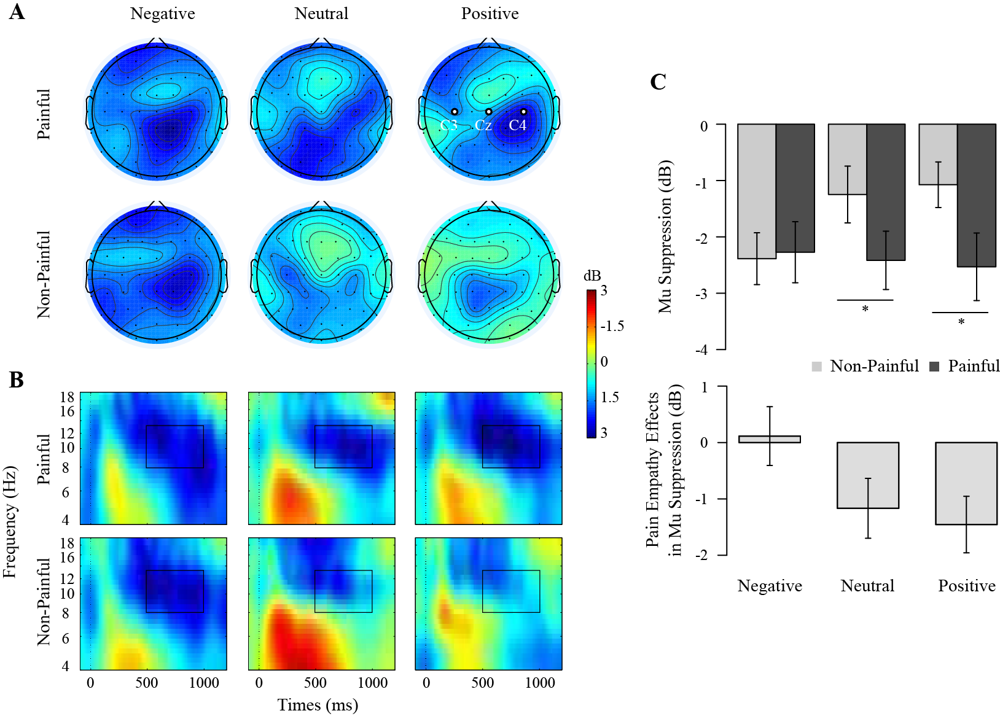
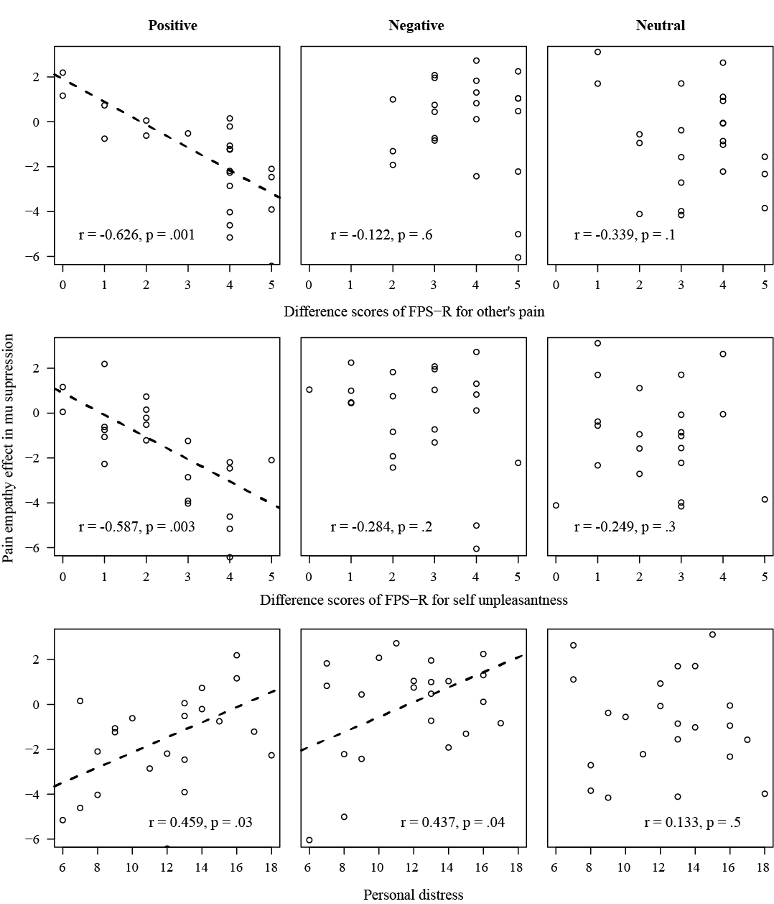
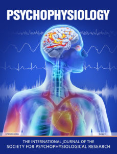
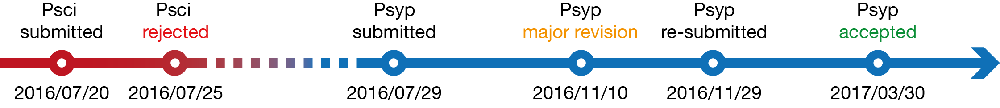
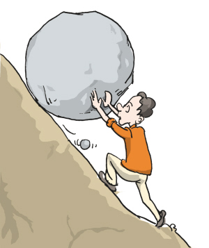

# 研究简介

## 疼痛共情 {.center}

---

## 疼痛共情 => 利他行为 {.center}

---

<h1 class="mood" style="font-size:1.3;margin-top:200px">MOOD</h1>

* 正性心境 => 帮助／利他行为
* 负性心境 =< 帮助／利他行为

## 相关文献 {.center}

* negative / positive mood -> reduced / enhanced motor/facial mimicry as an early automatic component in affective empathy (Kuhbandner, Pekrun, & Maier, 2010; Likowski et al., 2011)
* depression / bipolar disorders -> damaged empathic abilities (Thoma, Friedmann, & Suchan, 2013 for review)
* 正性 => 疼痛共情 & 负性 =< 疼痛共情

## 实验设计

>* 自变量：心境（欢快、中性、悲伤音乐）* 图片类型（疼、不疼）
>* 因变量：mu节律活动变化 -> 镜像神经元／感觉运动皮层活动 -> 疼痛共情指标

## 结果讨论 {.center}

---

---

# 投稿经验

## 关于期刊 {#about_journal}

**Psychophysiology**

IF: **3.074**

ISI JCR © Ranking 2015:

>* **4/14** (Psychology Biological);
>* 15/85 (Psychology Experimental);
>* 20/76 (Psychology);

## 投稿过程 {.center}

# 经验总结

## 给审稿人台阶下，给自己台阶下 {.center}

* 审稿人没有读懂文章？那是我们没写清楚明白
* 审稿人的观点不合理？拿证据证明我们是对的
* 审稿人抽风了？我们也要耐心解释
* 总之，一定灵活积极地采纳审稿人意见

## 用证据说话 {.center}

* 证据是用来证明作者是对的
* 不是用来证明审稿人是错的

## 用科学严谨的方法支撑好故事 {.center}

* 下限：方法和结果靠不靠谱
* 上限：故事好不好
* 秀下限 => 吹上限

## 切勿怀侥幸心理 {.center}

* 对研究的缺陷和棘手的问题做好心理准备
* 与其最后让审稿人揪出来，不如如实在讨论中阐明

# 审稿意见

## Question 1

> Reviewer: **Baseline adjustments** in your case seem somewhat problematic. Your induction could have changed the nature of the baseline as a function of frequency. This would be an important point to consider in evaluation of your EEG activations.

基线的节律活动会受到心境诱发的影响，那么基线后刺激诱发的节律活动势必会受到影响。

## Answer 1.1

> Firstly, the baseline adjustment procedure in the current study is to obtain the baseline-normalized spectrogram or the so-called event-related spectral perturbation in EEGLAB (Delorme et al. 2004). **According to the guidelines** for EEG and MEG (Keil et al. 2014; Cohen, 2014), the baseline segment should not be selected to lie in temporally close to the onset of an event of interest, because "temporal smoothing from time-frequency decomposition can produce some temporal leakage of trial-related activity to the pretrial time period, particularly if the activity occurs shortly after the time = 0 event (MX Cohen, 2014, p.232)". **>>> 找文献依据 + 了解方法**
>
> In current study, the baseline from -300ms to -100ms relative to the onset of stimulus was chosen after considering the trial procedure of the experiment and the signal of interest which was mainly the alpha band. As for the complete within-subject design, we used the grand averaged baseline power (8~13Hz, -300~-100ms) to obtain the normalized power (dB) of each condition.

## Answer 1.2

> Further, **statistical analyses on the baseline power (8~13Hz, -300~-100ms) showed no significant effect** (see the ANOVA table below). Therefore, we believe the baseline adjustment are appropriate for our data. **>>> 拿证据说话**

## Question 2

> It would be extremely important to see the **topography** of your EEG activity that justifies sensor selections for analyses. I do not understand why you felt compelled to look at **only three sensors** when you had undertaken a data integration procedure (ICA) that could have allowed you to use activity from ALL sensors simultaneously. This would certainly improve signal-to-noise and enhance your ability to evaluate condition effects of interest. Also, you chose to do **temporal ICA versus spatial ICA**. Are you confident that this was the best choice?

## Answer 2.1

为什么仅仅选择C3/Cz/C4?

> Based on the literature reviews of studies regarding mu rhythms and also pain empathy indicated by mu suppression (e.g. Muthukumaraswamy et al., 2004; Pfurtscheller et al., 2004; Penida, 2005; Yang et al., 2009; Cheng et al., 2008; Hoenen et al., 2013), the censors (C3,Cz,C4) over sensorimotor cortex were frequently selected. It was widely found that the ~10Hz band activity recorded by those censors were closely related to the activity of mirror neuron system and sensorimotor cortex (Penida, 2005 for review). **>>> 文献依据**
>
> Therefore, the selection of electrodes in our study was highly hypothesis-driven and for lowering the error of false positives we believe it was convincible to choose the three typical electrodes related to the neural correlate of interest. **>>> 了解方法**
>
> In the manuscript, we have already mentioned that “Although data were obtained from all electrodes across the scalp, mu suppression was defined as the mean mu power measured over sensorimotor cortex (C3, Cz, and C4; Oberman et al., 2005; 2007).”

## Answer 2.2

为什么使用temperal ICA?

> As far as we know, Independent Component Analysis (ICA) is a multivariate signal processing technique broadly employed in neuroimaging to separate (as much as possible) statistically independent components (ICs) from linearly mixed signals. Temporal ICA is dominant in EEG/MEG studies in which a set of signals, one from each electrode, are separated into temporally independent components (Calhoun et al., 2001; Onton et al., 2006; Keil et al., 2014). Whereas spatial ICA is dominant in fMRI studies mostly due to the reason that the spatial dimension is much larger than the temporal dimension in fMRI (Calhoun et al., 2001). The ICA approach implemented in EEGLAB used in our study were also temporal ICA. In our study, ICA was applied only to attenuate eye, muscle, and other stereotyped artifacts in EEG, although it has proved effectively separating biologically plausible brain sources (Delorme & Makeig, 2004; Keil et al., 2014). Thus, we believe the ICA was properly implemented in our study. **>>> 文献依据 + 了解方法**

## Question 3

> How did the authors decide **how many participants** to include in the study?

## Answer 3.1

> The sample size of our study was determined by previous experiences and knowledge we had in this field. As far as we known, there is no perfect sample size and perfect way to pre-determine it in a study, and it is acceptable to collect data from 20~40 subjects in every group in an EEG study. **>>>勿侥幸，实话实说**
>
> Post hoc power analysis via G*power (Faul, Erdfelder, Lang, & Buchner, 2007) demonstrated that the final sample size was enough for obtaining a relatively high power (observed power > 0.9) of key results in the current study. Consequently, we believe the sample size was in the safe zone. The post hoc power analysis was added into the manuscript. **>>> 拿证据说话**

---

## 题外话 {.center}

事后power分析不太靠谱，最好不要使用 >>> 了解方法

>* [Is it possible to calculate the power of study retrospectively?](https://www.researchgate.net/post/Is_it_possible_to_calculate_the_power_of_study_retrospectively)
>* [what to do if your editor asks for post-hoc power analyses](http://daniellakens.blogspot.hk/2014/12/observed-power-and-what-to-do-if-your.html)
>* [Post hoc power analysis for a non significant result?](http://stats.stackexchange.com/questions/193726/post-hoc-power-analysis-for-a-non-significant-result)

## Question 4

> How would be possible to disentangle **affective priming** from (maybe) a different mechanism linked to mood induction and its effect on empathic neural reactions? Did the authors consider this aspect?

## Answer 4.1

affective priming(AP)是什么?

> The phenomenon of priming is an implicit memory effect in which exposure to one stimulus (i.e., perceptual pattern) influences the response to another stimulus (“Priming (psychology),” 2016, Wikipedia). The affective priming is the phenomenon that it takes less time to evaluate a target stimulus if that target is preceded by a prime stimulus with the same valence compared to when the target stimulus is preceded by a prime stimulus with a different valence. It means that the congruence or in-congruence between target stimuli and prime stimuli will facilitate or compromise the processing and responses to the target stimuli respectively.

## Answer 4.2

心境诱发与AP有何差别？

> As far as we known, moods do have similar effects like affective priming, such as mood-congruent processing biases. **>>> 给审稿人台阶**
>
> Nevertheless, **the effects of mood are more complicated than that are observed in affective priming (see Forgas, 2013; Gruber et al., 2011; for reviews).** Moods can not only cause congruent but also in-congruent consequences. Moreover, moods can influence both low and high level cognitive processes and more complicated social cognition and behaviors as well. Since lexical materials and emotional picture are often used in affective priming, the effect elicited by those materials are more short-lived. By contrast, moods are more common, low-intense, and enduring, which produce more uniform and reliable consequences than do more context-specific emotions (Forgas, 1995, 2002, 2013 for reviews). Thus, **there are large differences between mood induction and affective priming procedures, such as the type of materials or stimuli, the duration, the procedures, or whether has specific cues or content.** In the current study, the durations of musical materials are about 10 seconds which is long enough to successfully induce specific moods. The results of manipulation check of mood induction showed that the moods were successfully induced. **>>> 列出根据，证明我是对的**

## Answer 4.3

心境诱发的效应可能不是AP

> More importantly, in terms of affective priming, if the required responses to the stimuli are congruent or in-congruent with the cue used for priming (moods of different valence), the corresponding responses should be facilitated or impeded respectively. However, there was no interaction effect between mood and pain, and also no main effect of mood in RT (reaction time) and ACC (accuracy), suggesting that behavioral responses were neither facilitated nor impeded. Thus, it safe to conclude that there is no pronounced effect related to affective priming. **>>>拿证据说话，证明我是对的**
>
> However, we could not ensure that there was no such effect mixed in the experiment. Thus, we added this comment into discussion. **给审稿人台阶，积极采纳审稿人意见**

## Answer 4.4

AP对共情的影响是值得关注的

> Nonetheless, **it is interesting to explore whether the affective priming can modulate the empathic responses to others’ sufferings.** In fact, there is one study we known that probed the priming effects of emotional images on empathy for pain (Meng et al., 2012). Meng et al. (2012) found that negative emotional primes strengthened observers’ attention towards others’ pain. Another study demonstrated that the unconscious negative affective priming facilitated pain detection during the observation of others’ pain (Yamada & Decety, 2009). However, it was not known that this priming effect would have large impact on empathy for pain both at the early/lower or the later/higher level of empathy, which calls for future research. **>>> 给审稿人台阶下**

## Question 5: Major Concern

> Reviewer: My main concern, that tempers my enthusiasm for these findings, is that it seems to me that **what drives all of the effects of mood on empathy is not the presence of a larger mu-suppression in the painful condition vs. the neutral condition in both positive and neutral mood but rather the presence of mu suppression also for the no-pain condition in the negative mood condition.** But this is masked by the fact that the effect of mu-suppression has been computed as a difference between the painful and neutral conditions. This critical aspect should be clearly described and explained.
>
> AE: I am in full agreement with the reviewer that **basing analyses on difference scores can complicate proper interpretation of your results.**

* 为什么做差值？
* 差值代表了什么？
* 为什么mu在负性心境下更强？
* 差值的做法是否常见？

## Answer 5.1

差值反映了疼痛共情效应

> Firstly, a precondition in the paradigm of pain empathy is that observing painful stimuli would invoke significantly stronger mu suppression than observing non-painful stimuli, which is frequently proved in previous studies (e.g. Cheng et al., 2008; Perry et al., 2010). This is also observed in neutral and positive mood condition in our study. What we are mostly intrigued with is why the mu suppression is not increased (with more negative values) in painful condition relative to non-painful condition. We argue that the enhancement of mu suppression of the painful condition relative to the non-painful condition represents the effect of pain empathy which could be measured by the difference scores between the two conditions. Hence, the absence of mu-suppression enhancement in negative mood condition during the observation of painful stimuli might hint that the empathic system is possibly inhibited to some extent. **>>>找文献依据，耐心解释**

* 疼痛共情范式：疼痛刺激诱发的mu suppression显著强于中性刺激
* mu suppression的增强反映了疼痛共情效应的产生
* 那么mu suppression差值反映了疼痛共情效应

## Answer 5.2

mu节律活动在不同心境下的确存在差异

> Secondly, why the values of mu-suppression associated with non-painful stimuli across three mood conditions are different to some extent?
>
> We infer that this is probably due to the different baseline level of sensorimotor cortex activity under various mood states. An array of evidence have demonstrated that moods or emotion contexts exert impacts on motor activity or behavioral responses (Canbeyli, 2010; Goldstein et al., 2007; Krüger, Seminowicz, Goldapple, Kennedy, & Mayberg, 2003; Ladavas, Nicoletti, Umiltá, & Rizzolatti, 1984; Liotti & Mayberg, 2001; Liotti, Mayberg, McGinnis, Brannan, & Jerabek, 2002; Liotti, Sava, Rizzolatti, & Caffarra, 1991; Mayberg et al., 1999). Specifically, negative mood compared with rest was associated with increased right premotor cortex activity (consisting of mirror neuron system) (Mayberg et al., 1999; Kruger et al., 2003). Liotti et al. (2002) found that **sad mood induction in healthy subjects and in unipolar depressed subjects were associated with a greater involvement of motor/premotor cortex.** It was also indicated that **negative mood interferes selectively with right hemisphere processing at the pre-motor stage** (Ladavas et al., 1984; Liotti et al., 1991). These evidences are consistent with our observation that negative relative to positive and neutral mood is linked with enhanced mu suppression for non-painful/neutral stimuli. **>>> 找文献依据**

## Answer 5.3

计算差值有助于分离掉不同心境状态对mu节律活动的影响

> Thirdly, since the procedures of mood induction between painful and non-painful conditions were equivalent, calculating the difference scores of mu-suppression isolated the influences of baseline activity of sensorimotor cortex to some extent so that can represent the effect of empathy for pain (painful relative to neutral conditions) at various mood states.

## Answer 5.4

差值的做法是很常见的

> Last but not least, numerous studies investigating empathy for pain also used difference scores of mu suppression to indicate the effect of empathy for pain (Woodruff et al., 2011; Hoenen et al., 2013, 2015; Cheng et al., 2008, 2014; Varnum et al., 2015). **>>> 找文献依据**
>
> The current study showed that during positive mood, the difference scores of mu-suppression (the pain empathy effect) were negatively correlated with the difference scores of subjective rating of pictures and also positively correlated with the scores of personal distress. The correlational results indicated that the more painful participants felt, the stronger mu suppression the pain empathy effect elicited. Thus, we believe that the results are meaningful and can provide insights on understanding the phenomenon of mood modulation of empathy for pain.

## 小结 {.center}

* 给足面子，积极采纳审稿人意见
* 勿怀侥幸，主动暴露研究不足
* 搞懂方法，别在方法上显得很业余
* 文献依据，提高信息检索能力

## 坚持到底 {.center}

## AND {.center}

## Thanks {.center}

> Citation: **Li, X., Meng, X. X., Li, H., Yang, J. M., & Yuan, J. J. (2017). The impacts of moods on empathy for pain: Evidence from an EEG study. Psychophysiology, in press.**
>
> Source: http://lix90.github.io/psyp-sharing/
